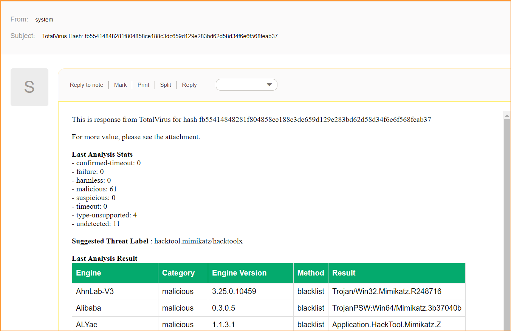

# OTRS-Znuny-Virus-Total-API
- collection of generic agent modules files to interact with VirusTotal api
- execute predefined webservice. 
- all the sent data payload (Mapping for outgoing request data), endpoint, authentication handle by the defined webservice itself.
- why use this method? the response json return invalid xml attributes when converting.
- can be tackle by pre-filter regex, but to avoid future unknown invalid attribute, use this module. 
- also allow more data mapping due complicated hash / array response data
	
 1. Upload webservices file (VirusTotal.yml) to znuny/otrs.
 2. Update your VirusTotal api key at Webservice (VirusTotal) > Znuny as requester > Network transport > HTTP::REST > Header
 
	x-apikey => 'VirusTotal API KEY'
 
 3. Each method required 3 different ticket dynamic field (text) as a source data.
 
		Hash  
		IPAddress  
		Domain  
 
 4.	VirusTotal Hash Generic Agent 
 
		- Name: VirusTotal Hash
		- Event: TicketDynamicFieldUpdate_Hash
		
		- Select Tickets
		-- Ticket# = *
		--  DynamicField_Hash = *
		
		- Execute Custom Module
		-- Module = Kernel::System::GenericAgent::VirusTotalHash
		
		-- Param 1 key	||	Param 1 value
		--- Webservice	||	VirusTotal
		
		-- Param 2 key	||	Param 2 value
		--- Invoker		||	GetHash
	
	
5.	VirusTotal Domain Generic Agent 

		- Name: VirusTotal Domain
		- Event: TicketDynamicFieldUpdate_Domain
		
		- Select Tickets
		-- Ticket# = *
		--  DynamicField_Domain = *
		
		- Execute Custom Module
		-- Module = Kernel::System::GenericAgent::VirusTotalDomain
		
		-- Param 1 key	||	Param 1 value
		--- Webservice	||	VirusTotal
		
		-- Param 2 key	||	Param 2 value
		--- Invoker		||	GetDomain
	
	
6.	VirusTotal IP Address Generic Agent 
	
		- Name: VirusTotal IP Address
		- Event: TicketDynamicFieldUpdate_IPAddress
		
		- Select Tickets
		-- Ticket# = *
		--  DynamicField_IPAddress = *
		
		- Execute Custom Module
		-- Module = Kernel::System::GenericAgent::VirusTotalIP
		
		-- Param 1 key	||	Param 1 value
		--- Webservice	||	VirusTotal
		
		-- Param 2 key	||	Param 2 value
		--- Invoker		||	GetIP
 
 
